# AlphaZero Board Games 🎮

Train and play strong board-game AIs from your terminal with a clean, practical AlphaZero implementation.

<p align="center">
  
</p>

## Why this repo

- **Playable immediately** with included checkpoints
- **Simple architecture** for learning and hacking
- **Three ready presets**: Gomoku 9×9, Gomoku 15×15, Connect4

## What’s included

```text
alphazero/      Shared core (game API, MCTS, network, RL loop)
gomoku_9_9/     9×9 Gomoku preset + trainer + stdio player
gomoku_15_15/   15×15 Gomoku preset + trainer + stdio player
connect4/       Connect4 preset + trainer + stdio player
```

Each game ships with pretrained checkpoints in its `data/` directory, so you can play right away.

## Related reading

- [AlphaGo: The story so far](https://deepmind.google/research/alphago/)
- [AlphaGo Zero: Starting from scratch](https://deepmind.google/blog/alphago-zero-starting-from-scratch/)
- [AlphaZero: Shedding new light on chess, shogi, and Go](https://deepmind.google/blog/alphazero-shedding-new-light-on-chess-shogi-and-go/)

## Quick start

### 1) Prerequisites

- Python 3.12+
- [uv](https://docs.astral.sh/uv/)

### 2) Install

```bash
uv sync
```

### 3) Play in terminal

```bash
uv run python -m gomoku_9_9.stdio_play
uv run python -m gomoku_15_15.stdio_play
uv run python -m connect4.stdio_play
```

## Controls and useful options

- **Gomoku move format:** `E5` or `E 5`
- **Connect4 move format:** column number (example: `4`)
- **Commands:** `help`, `quit`, `exit`

Common CLI flags:

- `--human-color B|W`
- `--simulation-num N`
- `--checkpoint-path PATH_PREFIX`

Example:

```bash
uv run python -m connect4.stdio_play --human-color W --simulation-num 400
```

## Train models

```bash
uv run python -m gomoku_9_9.trainer
uv run python -m gomoku_15_15.trainer
uv run python -m connect4.trainer
```

Override trainer config from CLI, for example:

```bash
uv run python -m gomoku_15_15.trainer -simulation_num 1200 -train_interval 20
```

## Run tests

```bash
uv run pytest
uv run pytest -m "not slow"
uv run pytest -m slow
```

## License

Apache-2.0
